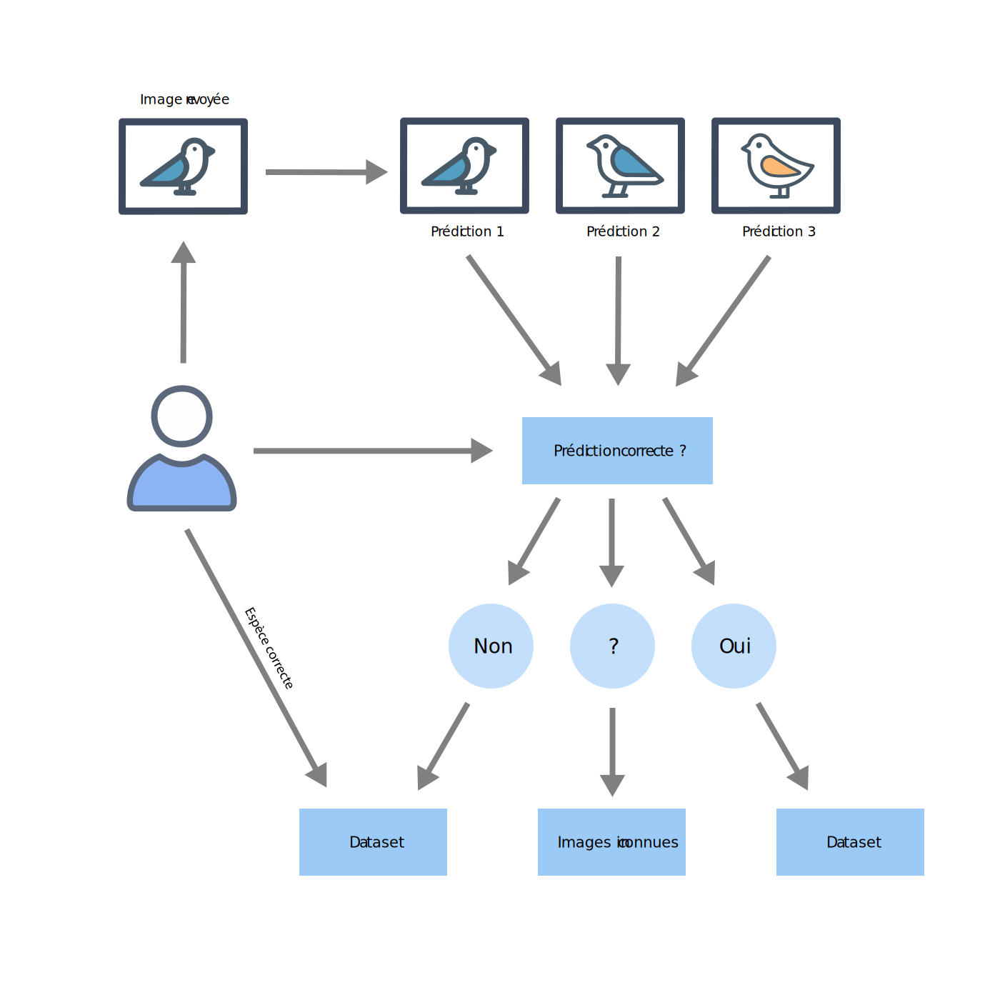
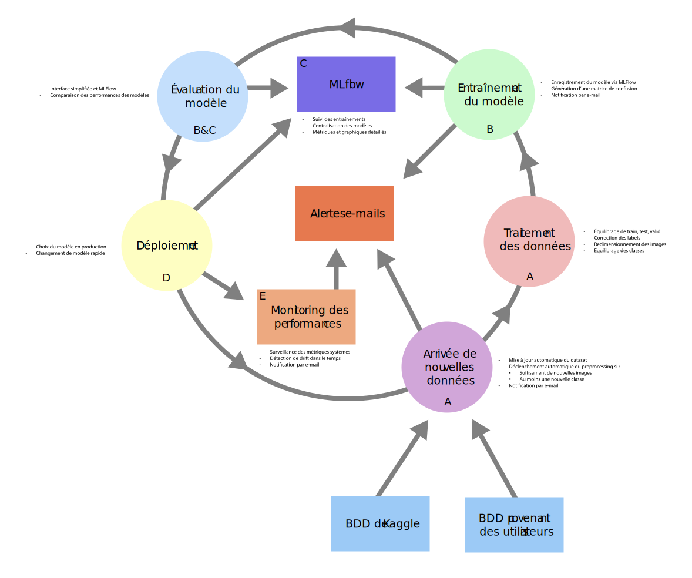

# Projet MLOps de reconnaissance d'oiseaux 

Ce projet implémente un système de reconnaissance d'images d'oiseaux, avec une infrastructure MLOps complète pour la gestion des données, l'entraînement, le déploiement et le monitoring du modèle.

**IMPORTANT** : seule la version docker est à jour avec toutes les dernières améliorations. Le code le plus récent se situe donc uniquement dans le dossier "docker".
Le reste du code est considéré comme ancien et ne doit être exécuté qu'à des fins d'expérimentation.

## Structure du projet

- [Application](./app/) Modules principaux de l'application
    - [Models](./app/models/) Classe dédiée à la prédiction
    - [Utils](./app/utils/) Scripts utilitaires de l'application
- [Data](./data/) Données relatives au dataset d'entraînement du modèle
- [Docker](./docker/) Répertoire contenant les données relatives aux différents conteneurs Docker
    - [Admin API](./docker/admin_api) Conteneur de l'API administrative
    - [Production](./docker/inference) Conteneur du modèle en production
    - [MLflow](./docker/mlflowui) Conteneur de l'interface MLflow
    - [Monitoring](./docker/monitoring) Conteneur de surveillance de l'état de santé du système et du modèle en production 
    - [Data processing](./docker/preprocessing) Conteneur de traitement des données
    - [Streamlit](./docker/streamlit) Conteneur de l'interface Streamlit
    - [Training](./docker/training) Conteneur d'entraînement
    - [User API](./docker/user_api) Conteneur de l'API client
- [Documentation](./docs/) Documentation détaillée du projet
- [Logs](./logs/) Historique des logs générés pendant l'exécution des différents scripts
- [MLRuns](./mlruns/) Historique des runs MLflow
- [Models](./models/) Historique des modèles
- [Monitoring](./monitoring/) Scripts pour le monitoring et la détection de drift
- [Preprocessing](./preprocessing/) Scripts de traitement des données
- [Temp images](./tempImage/) Stockage temporairement des images dans le cadre du fonctionnement de l'API et du modèle
- [Scripts](./scripts/) Scripts dédiés à la pipeline
- [Tests](./tests/) Tests unitaires et d'intégration
    - [Tests d'intégration](./tests/integration/) Tests d'intégration
    - [Tests unitaires](./tests/unit/) Tests unitaires
- [Training](./training/) Scripts pour l'entraînement du modèle

## Explication du projet

### Utilisation de l'application

1. **Upload de l'image** :
- L'image est d'abord envoyée par l'utilisateur sur le serveur, où elle est conservée dans un fichier temporaire.

2. **Inférence** :
- La prédiction de classe est effectuée en quelques centaines de millisecondes.
- Le résultat comprend les 3 classes les plus probables ainsi que leurs scores.
- Sont aussi affichées les images des classes en question pour aider l'utilisateur.

3. **Feedback** :
- Si l'utilisateur indique que la prédiction est correcte, on ajoute son image au dataset.
- Si il indique que la prédiction est fausse mais connaît l'espèce, il l'indique et on ajoute son image au dataset.
- Si il ne connaît pas l'image, on ajoute son image dans un dossier qui sera traité plus tard.

Cette architecture supporte efficacement le flux de travail participatif, permettant une amélioration continue du modèle grâce aux contributions des utilisateurs.

### Architecture Docker

1. **Gestion des données** :
- Entièrement autonome.
- Responsable de l'acquisition, du nettoyage et de l'augmentation des données, y compris les nouvelles images soumises par les utilisateurs.
- Gère la création de nouvelles classes pour les espèces non répertoriées.

2. **Entraînement** :
- Orchestre l'entraînement du modèle EfficientNetB0, s'adaptant aux nouvelles classes et données.
- Utilise MLflow pour le suivi des expériences et la gestion des versions, crucial avec l'évolution constante du dataset.

3. **Production** :
- Héberge le modèle optimisé pour des prédictions en temps réel sur les nouvelles images soumises.
- Se met à jour régulièrement pour intégrer les améliorations basées sur les contributions des utilisateurs.

4. **API client** :
- Fournit des endpoints pour la soumission d'images, la récupération des prédictions, et la gestion des contributions utilisateurs.
- Gère l'authentification et les autorisations pour sécuriser les contributions.

5. **API administrative** :
- Fournit des endpoints pour la gestion des données, des utilisateurs et des entraînements, pour la comparaison des métriques et le choix du modèle en production.

6. **Interface** :
- Interface Streamlit intuitive permettant aux utilisateurs de soumettre des images, voir les prédictions, et contribuer au dataset.
- Offre des visualisations des performances du modèle et de l'évolution du dataset.

7. **Monitoring** :
- Surveille en temps réel les performances du modèle, particulièrement important avec l'ajout constant de nouvelles données.
- Détecte les drifts potentiels causés par l'évolution du dataset.

8. **MLflow** :
- Centralise la gestion des expériences, des modèles et des métriques.
- Crucial pour suivre l'évolution du modèle avec l'intégration continue de nouvelles données et classes.

Cette architecture supporte efficacement le flux de travail participatif, permettant une amélioration continue du modèle grâce aux contributions des utilisateurs.

### Pipeline CI/CD

Notre pipeline permet une actualisation des données constantes ainsi qu'un modèle toujours performant et évolutif.

1. **Arrivée de nouvelles données** :
Les données sont téléchargées et corrigées dans un dossier dataset_raw (données brutes) puis déplacées dans un dossier dataset_clean une fois ayant passé l'étape du traitement des données (preprocessing).
Tout nouvelle image arrive d'abord dans dataset_raw et se retrouve plus tard dans dataset_clean lors du preprocessing, qu'elle soit ajoutée par l'utilisateur ou qu'elle provienne de Kaggle.
Un processus automatique chaque jour vérifie la disponibilité d'un nouveau dataset sur Kaggle. Si une version plus récente est disponible, elle est téléchargée.
Dès qu'un nouveau dataset est téléchargé, le preprocessing des données se lance directement.

2. **Traitement des données** :
Lors du lancement d'un preproccessing, les labels du dataset Kaggle sont corrigés avec les noms corrects et qui correspondent à la liste qui permet d'ajouter une nouvelle espèce.
Aussi, les dossiers train/test/valid sont répartis avec un équilibre de 70%/15%/15%.
Le script s'assure de suivre les nouvelles images et classes :
- Lorsqu'un certain nombre de nouvelles images (au moins l'équivalent de 1% de la totalité du dataset) est ajouté par les utilisateurs, un preprocessing est lancé.
- Lorsqu'une nouvelle classe apparaît, elle ne passe jamais à travers le script de preprocessing, même si déclenché par les événements ci-dessus, tant qu'elle n'a pas suffisamment d'images.
On considère qu'une classe est complète lorsqu'elle dispose au moins du même nombre d'images que la classe la plus petite de notre dataset. Lorsque la condition est remplie, un preprocessing se lance et cette classe se voit intégrée.
Dès qu'un preprocessing est lancé, cela signifie que les données ont changé de manière suffisante pour déclencher une alerte aux administrateurs et les encourager à réentraîner le modèle.

3. **Entraînement du modèle** :
Un entraînement du modèle peut-être déclenché manuellement par un administrateur, par exemple car il a reçu une alerte indiquant une dérive du modèle ou l'arrivée de nombreuses nouvelles données.
Lorsqu'un entraînement est terminé, l'administrateur est notifié et les informations relatives au nouveau modèle sont enregistrées dans MLflow.
Aussi, une matrice de confusion couplée avec un rapport de classification est sauvegardée pour faire état de la performance du modèle à sa création.

4. **MLflow** :
Durant et après un entraînement, MLflow s'assure du suivi des métriques et de l'enregistrement des modèles ainsi que de la matrice évoquée plus haut.
Il dispose d'une interface permettant d'afficher toutes les informations relatives aux entraînements et de faire les comparaisons nécessaires entre les modèles.
Son intérêt est également de servir de moyen d'archive des modèles générés.

5. **Évaluation du modèle** :
Une fois un entraînement terminé, l'administrateur peut afficher une comparaison entre le modèle en production et celui qui vient d'être entraîné.
Pour cela, il dispose des deux métriques les plus importantes, à savoir la validation_accuracy et la validation_loss, mais également d'une liste des noms et scores des 10 classes sur lesquelles le modèle est le moins performant, permettant de faciliter la prise de décision pour changer de modèle.

6. **Déploiement** :
Pour déployer le modèle, l'administrateur peut choisir parmi tous les modèles dans MLflow et simplement indiquer lequel passer en production.
Le script chargé de l'inférence pour les utilisateurs charge en quelques secondes le nouveau modèle, sans interruption de service (seulement une attente si prédiction demandée en même temps que le changement de modèle).

7. **Monitoring des performances** :
Grâce à la matrice de confusion enregistrée avec chaque modèle, tous les jours, une nouvelle matrice est générée et comparée avec l'originale du modèle.
Grâce à cela, il est possible de détecter un drift du modèle,soit une perte de performance sur certaines classes qu'il connaît à cause de nouvelles images qui peuvent être trop différentes de son entraînement.
Un rapport est envoyé tous les jours avec les 10 meilleures et pires classes ainsi que les classes qui dérivent (positivement ou négativement, s'il y en a).

8. **Gestion des conflits**
Pour éviter des conflits entre les scripts de monitoring, de preprocessing et de training, chacun indique en permanence son état aux autres.
Cela permet à l'un d'attendre que l'autre soit fini pour se lancer et éviter des erreurs ou corruption de données.

## Installation

**IMPORTANT** : seule la version docker est à jour avec toutes les dernières améliorations. Le code le plus récent se situe donc uniquement dans le dossier "docker".
Le reste du code est considéré comme ancien et ne doit être exécuté qu'à des fins d'expérimentation.

**Version docker (recommandé) :**

1. Installez Docker Desktop et lancez le.
2. Clonez le repository et aller dans le dossier "docker".
3. Complétez le fichier .env situé dans le dossier "docker" (non celui à la racine du projet) avec vos identifiants Gmail (il ne faut pas utiliser le mot de passe du compte, mais générer un "App password" via l'interface de gestion du compte Google).
   - Si des identifiants de tests sont déjà présents, indiquez simplement l'adresse email qui recevra les alertes.
5. Ajoutez ensuite dans le même .env vos identifiants Kaggle (connectez-vous à votre compte kaggle.com puis "Settings > API > Create New Token").

**Version sans docker (non recommandé) :**

1. Clonez ce repository.
2. Installer une version de python située entre 3.10.2 et 3.10.14.
3. Installez les dépendances : `pip install -r requirements.txt`.
4. Complétez le fichier .env situé à la racine du projet avec vos identifiants Gmail (il ne faut pas utiliser le mot de passe du compte, mais générez un "App password" via l'interface de Gestion du compte Google).
5. Ajoutez ensuite dans le même .env vos identifiants Kaggle (connectez-vous à votre compte kaggle.com puis "Settings > API > Create New Token").

## Utilisation

**Version docker (recommandé) :**

1. Entrez dans le répertoire "docker" du projet avec le terminal.
2. Avant chaque docker compose, nettoyer les conteneurs.
    - Il est possible de commenter ou non la ligne supprimant le volume : `docker volume rm docker_main_volume`. Il est préférable de la commenter si vous ne souhaitez pas retélécharger le dataset à nouveau.
    - Sur Windows, exécutez `./clean.ps1`.
    - Sur Linux, exécutez `./clean.sh`.
3. Lancez les conteneurs.
    - Si vous avez une carte graphique Nvidia : `docker-compose -f docker-compose-nvidia.yml up`.
    - Si vous n'avez pas de carte graphique Nvidia ou que vous n'êtes pas sûr : `docker-compose -f docker-compose.yml up`.

**IMPORTANT** : lors de la création du volume, le dataset sera téléchargé et le preprocessing lancé. Les routes des API indiqueront qu'il faut attendre mais l'interface Streamlit peut indiquer des erreurs. Il suffit de patienter jusqu'à recevoir le mail de confirmation à la fin de l'opération.

- Liste des applications web disponibles sur votre réseau local :
    - API client (port 5000) : `http://localhost:5000/docs`
    - API administrative (port 5100) : `http://localhost:5100/docs`
    - Interface MLflow (port 5200) : `http://localhost:5200`
    - Interface Streamlit (port 5300) : `http://localhost:5300`

- Vous pourrez interagir avec les APIs en tant que :
    - **administrateur** avec les identifiants **admin/admin**.
    - **utilisateur** avec les identifiants **user/user**.

**Version sans docker (non recommandé) :**

- Pour exécuter la pipeline complète : `python scripts/pipeline.py`
    - Pour télécharger le dataset : `python scripts/downloadDataset.py`
    - Pour effectuer le traitement obligatoire des données : `python preprocessing/preprocess_dataset.py`
    - Pour entraîner le modèle : `python training/train_model.py`

## Contribution

Les pull requests sont les bienvenues. Pour des changements majeurs, veuillez d'abord ouvrir une issue pour discuter de ce que vous aimeriez changer.
